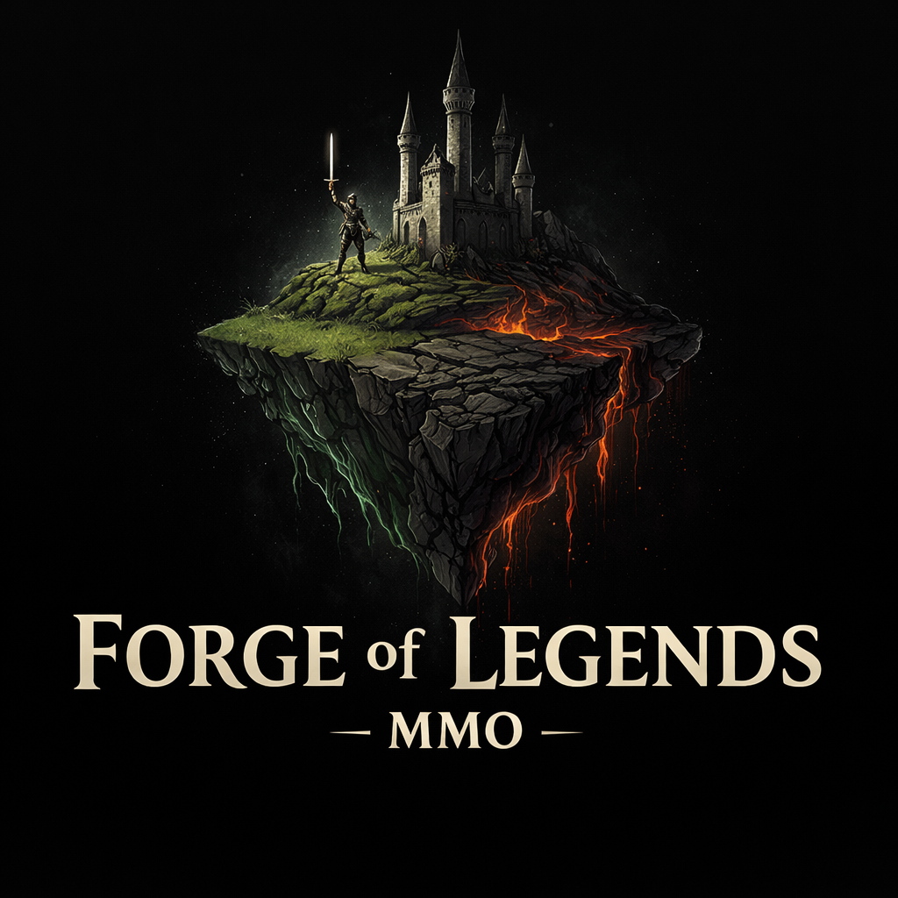

# 🌑 Forge of Legends — Web-Based MMORPG

<p align="center">
  
  <h2 align="center">FORGE OF LEGENDS</h2>
</p>

A fully custom, browser-based MMORPG powered by **Three.js**, **Node.js**, and **Supabase**.  
Built in **GitHub Codespaces** for rapid development and cloud-level performance.

Dominion is an evolving fantasy world built around factions, corruption systems, dynamic regions, and player-driven progression.  
This repository contains both the **client** and the **API backend** that power the game.

---

## 🚀 Tech Stack

### **Frontend (Game Client)**
- **Three.js** — 3D rendering
- **HTML5 Canvas**
- Modular ES6 architecture
- Secure API communication via Bearer tokens
- Email/password authentication guarded by ALTCHA human verification widget

### **Backend (API)**
- **Node.js + Express**
- **Supabase (Postgres + Auth)**
- Service Role secure data access
- JWT authentication middleware
- Profile creation, fetching, and updating

### **Development Environment**
- GitHub **Codespaces**
- ES modules
- `.env` support
- Hot reload for backend (optional)

---

## 🔥 Features (Implemented)

### ✅ **Supabase Integration**
- Secure Service Role backend connection  
- JWT verification with `verifyAuth.js`  
- Protected routes for all profile operations  

### ✅ **Player Profile System**
- Create profile  
- Fetch profile  
- Update stats  
- Update race/faction  
- XP and level logic (expandable)  

### ✅ **Client Authentication**
- Supabase login system  
- Access token forwarding to API  
- Basic login flow scaffolding  

### ✅ **Three.js Starter World**
- Verdanthal Grove test scene  
- Camera + lighting  
- Basic world rendering flow

---

## 📁 Project Structure

```plaintext
Forge-of-Legends/
    dominion-api/
        server.js
        .env
        services/
            supabase.js
        middleware/
            verifyAuth.js
        routes/
            profile.js
    dominion-client/
        index.html
        main.js
        assets/
            logo.png
        src/
            network/
            authClient.js
            api.js
            game/
                flow.js
            scenes/
                verdanthal.js
```

---

## 🛠 How to Run (Codespaces)

### **1. Start the API**
Inside the Codespace:

```bash
cd dominion-api
node server.js
```

If configured correctly, you'll see:

```bash
Dominion API running on port 3000
``` 
2. Run the Client

Open ```dominion-client/index.html``` using Codespaces’ “Preview” feature.

The client will:

Log in with Supabase

Fetch the player profile

Load the test Three.js world

---

### 🔐 Environment Variables

Place in dominion-api/.env:

```bash
SUPABASE_URL=your-supabase-url
SUPABASE_SERVICE_ROLE_KEY=your-service-role-key
PORT=3000
# Optional ALTCHA configuration
# - ALTCHA_DISABLE=true   # bypass external human verification (development/test)
# - ALTCHA_VERIFY_URL=... # custom verification endpoint (defaults to https://api.altcha.org/api/v1/siteverify)
```

⚠ Never expose the service role key in the client.

---

### 🧩 Planned Features
## 📌 World Systems

- Region loader (Verdanthal → Witherblight → Titanfall)
- Environment interaction
- NPCs and creature AI

## 📌 Player Systems

- Inventory
- Equipment
- Combat skills
- Corruption progression system

## 📌 Networking

- Real-time multiplayer
- Party system
- Chat system

---

### 🤝 Contributing

Dominion is a private solo project under active development by Kai (Mrkallum / KaiAshenveil).
Pull requests are welcome but may not be merged without review.

---

### 🜂 License

All rights reserved.
Do not redistribute without permission.

---

### 💬 Contact

For questions or dev logs, contact Kai Ashenveil.